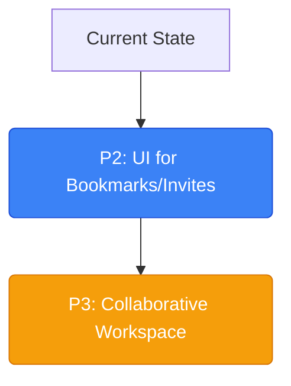

# ag.md — Comprehensive Project Status & Codebase Audit

This document provides a detailed status report of the **peerY** codebase, auditing all recent developments and comparing current progress with the roadmaps outlined in `CLAUDE.md`, `plan.md`, and `anurag.md`.

---

## 1. Executive Summary

Since the last log entry in `anurag.md`, the platform's backend services have undergone a massive upgrade, closing all major functional gaps in the core product lifecycle. We have transitioned key planned features (Bookmarks, Invitations, Project management operations, Zod validation, and Socket.io server-side setups) from **scaffolded/empty stubs** to **fully functional, production-ready modules**. Additionally, we solved local Atlas connection problems, sanitized double-slash preflight errors, matched the Dashboard to the premium landing page light-theme grid aesthetic, and fully wired active filters on the Discover page.

---

## 2. Comprehensive Status Matrix (Verified)

| Phase | Feature/Area | Status in `plan.md` | Actual Code Status | Notes |
| :--- | :--- | :--- | :--- | :--- |
| **Phase 1** | Auth API (Register, Login, Me, Logout) | ✅ Done | **✅ Complete** | Includes token persistence & session recovery. |
| **Phase 1** | Auth Security (Zod Validation) | 🚧 Planned | **✅ Complete** | Input schemas verified on the router-level edge. |
| **Phase 1** | Profile CRUD | ✅ Done | **✅ Complete** | Users can create/read/update/delete their profiles. |
| **Phase 1** | Security Hardening | 🚧 Planned | **✅ Complete** | Helmet & express-rate-limit configured in `App.ts`. |
| **Phase 1** | Landing page | ✅ Done | **✅ Complete** | Premium Light-Theme grid aesthetic. |
| **Phase 2** | Discovery Feed & Match scoring | ✅ Done | **✅ Complete** | Recommended profiles fetched via aggregate scores. Bypasses onboarding 404 blockages. |
| **Phase 2** | Swipe & Match Engine (Likes, Mutual) | ✅ Done | **✅ Complete** | Mutual likes trigger auto-accept. |
| **Phase 2** | Discover & Swipe UI (client) | 🟡 Mock data | **✅ Complete** | Both Discover feed and detailed BuilderProfilePage are live and wired to the API. Search and all filters fully active. |
| **Phase 2** | Real-time Notifications | 🟡 Persisted only | **✅ Complete** | Sockets emit notification:received events in matches, applications, and invites. |
| **Phase 3** | Projects CRUD | 🟡 Partial | **✅ Complete** | Create/List/Get + Update/Delete/Archive are all live. |
| **Phase 3** | Project Bookmarks | 🚧 Stubbed | **✅ Complete** | Fully implemented on backend & frontend (Dashboard UI). |
| **Phase 3** | Project Invitations | 🚧 Stubbed | **✅ Complete** | Fully implemented on backend & frontend (Accept/Reject UI). |
| **Phase 3** | Socket.io server wiring | 🚧 Stubbed | **✅ Complete** | Configured with JWT authentication and status tracking. |
| **Phase 3** | Collaborative Workspace | 🚧 Planned | **🚧 Planned** | Kanban board, workspace chat, and file storage. |

---

## 3. Auditing Recent Implementations

The following files have been built and verified in the codebase:

### 3.1 Project Bookmarks Module
Allows users to save projects for future reference. Auto-increments/decrements project bookmark counters.
*   **Documentation**: Contract is detailed in [bookmark.md](file:///d:/D%20drive/1/videos/movie/1.dev/Cohort%203.0/WEB%20DEV/cohort-3%20codes/New%20folder/peerY/Contexts/Docs/bookmark.md).
*   **Validation**: [Bookmark.validation.ts](file:///d:/D%20drive/1/videos/movie/1.dev/Cohort%203.0/WEB%20DEV/cohort-3%20codes/New%20folder/peerY/Server/Src/Modules/Projects/Validation/Bookmark.validation.ts) uses Zod to check parameters and queries.
*   **Model**: [Bookmark.model.ts](file:///d:/D%20drive/1/videos/movie/1.dev/Cohort%203.0/WEB%20DEV/cohort-3%20codes/New%20folder/peerY/Server/Src/Modules/Projects/Models/Bookmark.model.ts) enforces uniqueness per user per project using `{ user: 1, project: 1 }` unique index.
*   **Repository**: [Bookmark.repos.ts](file:///d:/D%20drive/1/videos/movie/1.dev/Cohort%203.0/WEB%20DEV/cohort-3%20codes/New%20folder/peerY/Server/Src/Modules/Projects/Repos/Bookmark.repos.ts) contains lean queries for CRUD.
*   **Service**: [Bookmark.services.ts](file:///d:/D%20drive/1/videos/movie/1.dev/Cohort%203.0/WEB%20DEV/cohort-3%20codes/New%20folder/peerY/Server/Src/Modules/Projects/Services/Bookmark.services.ts) implements count management.
*   **Controller**: [bookmark.controller.ts](file:///d:/D%20drive/1/videos/movie/1.dev/Cohort%203.0/WEB%20DEV/cohort-3%20codes/New%20folder/peerY/Server/Src/Modules/Projects/Controllers/bookmark.controller.ts) maps endpoints:
    *   `POST /api/v1/project/:projectId/bookmark` (Create bookmark)
    *   `DELETE /api/v1/project/:projectId/bookmark` (Delete bookmark)
    *   `GET /api/v1/bookmarks/me` (List my bookmarks)

### 3.2 Project Invitations Module
Enables project members with `canInviteMembers` permissions to invite other builders directly to their projects.
*   **Documentation**: Contract is detailed in [invitation.md](file:///d:/D%20drive/1/videos/movie/1.dev/Cohort%203.0/WEB%20DEV/cohort-3%20codes/New%20folder/peerY/Contexts/Docs/invitation.md).
*   **Validation**: [Invitation.validation.ts](file:///d:/D%20drive/1/videos/movie/1.dev/Cohort%203.0/WEB%20DEV/cohort-3%20codes/New%20folder/peerY/Server/Src/Modules/Projects/Validation/Invitation.validation.ts) validates input payload, custom roles, and query lists.
*   **Model**: [Invitation.model.ts](file:///d:/D%20drive/1/videos/movie/1.dev/Cohort%203.0/WEB%20DEV/cohort-3%20codes/New%20folder/peerY/Server/Src/Modules/Projects/Models/Invitation.model.ts) maps statuses (`PENDING`, `ACCEPTED`, `REJECTED`, `WITHDRAWNED`).
*   **Repository**: [Invitation.repos.ts](file:///d:/D%20drive/1/videos/movie/1.dev/Cohort%203.0/WEB%20DEV/cohort-3%20codes/New%20folder/peerY/Server/Src/Modules/Projects/Repos/Invitation.repos.ts) supports populating user credentials.
*   **Service**: [Invitation.services.ts](file:///d:/D%20drive/1/videos/movie/1.dev/Cohort%203.0/WEB%20DEV/cohort-3%20codes/New%20folder/peerY/Server/Src/Modules/Projects/Services/Invitation.services.ts) handles:
    *   Validation of the inviter's workspace roles/permissions.
    *   Prevention of invitations to existing members or duplicated pending invites.
    *   Atomic creation of `Member` documents and member counter increment upon acceptance.
*   **Controller**: [invitation.controller.ts](file:///d:/D%20drive/1/videos/movie/1.dev/Cohort%203.0/WEB%20DEV/cohort-3%20codes/New%20folder/peerY/Server/Src/Modules/Projects/Controllers/invitation.controller.ts) maps:
    *   `POST /api/v1/project/:projectId/invite` (Send invite)
    *   `GET /api/v1/project/:projectId/invitations` (List invitations for project)
    *   `GET /api/v1/invitations/me` (List user's pending invites)
    *   `PATCH /api/v1/invitations/:invitationId/accept` (Accept invite)
    *   `PATCH /api/v1/invitations/:invitationId/reject` (Reject invite)
    *   `PATCH /api/v1/invitations/:invitationId/withdraw` (Withdraw invite)

### 3.3 Project Lifecycle Extension
Added update, delete, and archive handlers to [project.controller.ts](file:///d:/D%20drive/1/videos/movie/1.dev/Cohort%203.0/WEB%20DEV/cohort-3%20codes/New%20folder/peerY/Server/Src/Modules/Projects/Controllers/project.controller.ts) and [Project.services.ts](file:///d:/D%20drive/1/videos/movie/1.dev/Cohort%203.0/WEB%20DEV/cohort-3%20codes/New%20folder/peerY/Server/Src/Modules/Projects/Services/Project.services.ts).
*   `updateProject`: Permits updates to title, description, banner, stage, category, tech stack, requirements, and visibility, checking owner authority.
*   `deleteProject`: Deletes the project and performs cascade deletion of all associated `Member`, `Application`, and `Bookmark` models.
*   `archiveProject`: Sets `isArchived = true` (excluding it from main queries).

### 3.4 Security Hardening
Configured in [App.ts](file:///d:/D%20drive/1/videos/movie/1.dev/Cohort%203.0/WEB%20DEV/cohort-3%20codes/New%20folder/peerY/Server/Src/App.ts):
*   `helmet`: Adds secure HTTP headers.
*   `express-rate-limit`: Configured `globalLimiter` (150 requests / 15 minutes) and a restrictive `authLimiter` (30 requests / 15 minutes) protecting auth routes.

### 3.5 Real-Time Layer (Socket.io)
Configured in [Server.ts](file:///d:/D%20drive/1/videos/movie/1.dev/Cohort%203.0/WEB%20DEV/cohort-3%20codes/New%20folder/peerY/Server/Server.ts) and [index.ts (Sockets)](file:///d:/D%20drive/1/videos/movie/1.dev/Cohort%203.0/WEB%20DEV/cohort-3%20codes/New%20folder/peerY/Server/Src/Sockets/index.ts):
*   Authenticates socket connections using JWT tokens extracted from handshakes, headers, or query parameters.
*   Maps connected users to socket IDs in a thread-safe `onlineUsers` map.
*   Provides a status framework with `user:online` and `presence:check` events.
*   Scaffolded real-time notification emission helper `sendNotificationToUser`.

---

## 4. Current Gaps & Immediate Backlog

To achieve full production readiness, the following roadmap is recommended:

### ✅ P0 — Wire Builder Profiles to the Live API (Completed)
*   **Implementation**: 
    1. Created `GET /api/v1/profile/:profileId` endpoint on the server.
    2. Added client `getPublicProfile` service.
    3. Refactored `BuilderProfilePage.tsx` to fetch dynamic data from the live API.

### ✅ P1 — Integrate Real-Time Notifications (Sockets) inside Controllers/Services (Completed)
*   **Implementation**:
    1. Integrated `sendNotificationToUser` inside `sendNotification` middleware helper (covering all match and application events).
    2. Integrated direct `sendNotificationToUser` inside project `sendInvitation` and `acceptInvitation` service methods.

### ✅ P2 — Client-Side UI for New Features (Completed)
*   **Implementation**:
    1. Built workspace lists, member projects list, and public projects exploration tabs.
    2. Created the Invitations and Bookmarks pages, fully wired to the backend API services with real-time feedback.
    3. Created a dedicated Network page supporting incoming requests approval/rejection and unmatching.
    4. Created the Messages page with real-time socket.io chat room integration.

### 🚧 P3 — Collaborative Workspace Features
*   **Requirement**:
    *   Implement Kanban boards on the client/server database collections.
    *   Introduce workspace-specific file uploads.

